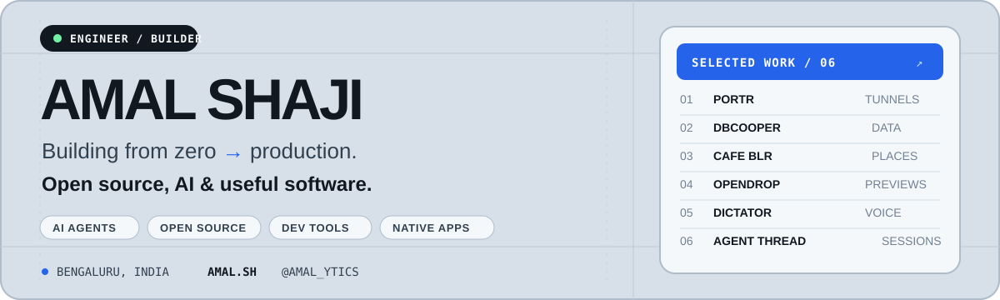

  

  <a href="https://amal.sh">amal.sh</a>
  ·
  <a href="mailto:amalshajid@gmail.com">email</a>
  ·
  <a href="https://x.com/amal_ytics">@amal_ytics</a>
  ·
  <a href="https://github.com/amalshaji?tab=repositories">all repositories</a>

I work on **AI agents during the day**, then spend my nights shipping developer tools and small internet experiments. I like software that stays out of the way: native utilities, infrastructure you can self-host, and focused products with a clear reason to exist.

Currently building from Bengaluru, India.

## Selected work

<table>
  <tr>
    <td width="50%" valign="top">
      <h3><a href="https://github.com/amalshaji/dictator">Dictator</a></h3>
      
A native macOS dictation app. Hold <code>Fn</code>, speak, and send polished text back to the app you were using—with on-device Apple Speech or your own cloud provider.

      
SWIFT · SWIFTUI · APPLE SPEECH · MACOS

    </td>
    <td width="50%" valign="top">
      <h3><a href="https://github.com/amalshaji/opendrop">OpenDrop</a></h3>
      
Publish versioned static previews, share them privately or publicly, and collect point comments and text highlights in context.

      
TYPESCRIPT · BUN · REACT · CLOUDFLARE

    </td>
  </tr>
  <tr>
    <td width="50%" valign="top">
      <h3><a href="https://cafeblr.com">Cafe BLR</a> <a href="https://github.com/amalshaji/cafeblr">GitHub ↗</a></h3>
      
A map-friendly directory of Bengaluru cafes discovered through posts people actually loved—the original recommendation stays attached as the receipt.

      
ASTRO · TYPESCRIPT · CLOUDFLARE · OPEN DATA

    </td>
    <td width="50%" valign="top">
      <h3><a href="https://dbcooper.amal.sh">DBcooper</a> <a href="https://github.com/amalshaji/dbcooper">GitHub ↗</a></h3>
      
A lightweight desktop database client for PostgreSQL, SQLite, Redis, and ClickHouse—with a native shell and AI-assisted SQL.

      
RUST · TAURI · REACT · TYPESCRIPT

    </td>
  </tr>
  <tr>
    <td width="50%" valign="top">
      <h3><a href="https://portr.dev">Portr</a> <a href="https://github.com/amalshaji/portr">GitHub ↗</a></h3>
      
An open-source tunnel for teams. Expose local HTTP, TCP, and WebSocket services through SSH, then inspect and replay traffic locally.

      
GO · REACT · SSH · SELF-HOSTED

    </td>
    <td width="50%" valign="top">
      <h3><a href="https://agent-thread.com">Agent Thread</a> <a href="https://github.com/amalshaji/agent-thread">GitHub ↗</a></h3>
      
Share and convert Claude Code and Codex sessions without turning useful agent work into an unreadable transcript dump.

      
TYPESCRIPT · CLAUDE CODE · CODEX

    </td>
  </tr>
</table>

## Latest from the workshop

RECENT PUBLIC COMMITS · CAPTURED 16 JULY 2026

| Date | Project | Shipped |
|---|---|---|
| 16 Jul | [`dictator`](https://github.com/amalshaji/dictator) | [`Prepare 0.5.0 release`](https://github.com/amalshaji/dictator/commit/1c5cab1842a77f164dccfb43fba95f1c913f1193) |
| 13 Jul | [`cafeblr`](https://github.com/amalshaji/cafeblr) | [`Refresh verified tweet like counts`](https://github.com/amalshaji/cafeblr/commit/4fac162affa08cbfc4fb3f75b09d969e81827f01) |
| 12 Jul | [`opendrop`](https://github.com/amalshaji/opendrop) | [`Release OpenDrop 0.3.0`](https://github.com/amalshaji/opendrop/commit/39b1d0be290fa9f35f9abbf6a2c1b27d0a0f0ab4) |
| 11 Jul | [`dbcooper`](https://github.com/amalshaji/dbcooper) | [`Fix the macOS Dock icon and release v0.0.60`](https://github.com/amalshaji/dbcooper/commit/e363271e3d8e3f00bed6a6f10e8fe48f368df1aa) |
| 10 Jul | [`portr`](https://github.com/amalshaji/portr) | [`Add reserved subdomain reservations`](https://github.com/amalshaji/portr/commit/9e93079a553d6c6dd587f2aa82d16f7f0552ad0c) |

<a href="https://github.com/amalshaji?tab=overview&from=2026-07-01&to=2026-07-31">See the full contribution graph →</a>

## Around the workshop

- [`agent-observability`](https://github.com/amalshaji/agent-observability) — session reports, evals, and performance views for voice agents.
- [`dbindex`](https://github.com/amalshaji/dbindex) — a browser-based database explorer built with Bun, Hono, and React.
- [`baby-cursor`](https://github.com/amalshaji/baby-cursor) — a small Cursor-inspired code editor that runs in the browser.

My current working set is **Swift / SwiftUI**, **TypeScript / React**, **Go**, **Rust / Tauri**, **Python / FastAPI**, **Bun / Cloudflare**, and **Postgres / Redis**. The tool changes; the goal is usually the same—make the complicated part feel obvious.

## Notes from the build

I write when a project teaches me something worth keeping:

- [Portr: an open-source, self-hosted tunnel designed for teams](https://dev.to/amal/portr-open-source-self-hosted-tunnel-designed-for-teams-hjb)
- [Docker best practices for Python developers](https://testdriven.io/blog/docker-best-practices/)
- [Dockerizing FastAPI with Postgres, Uvicorn, and Traefik](https://testdriven.io/blog/fastapi-docker-traefik/)

## Say hello

Have an interesting developer-tooling, infrastructure, or AI-agent idea? [Send me an email](mailto:amalshajid@gmail.com). I am always happy to compare notes with people who like building useful things.
